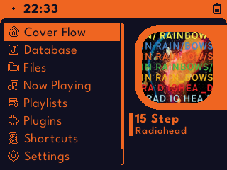
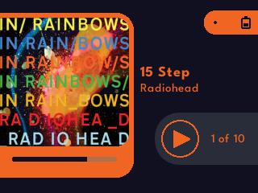
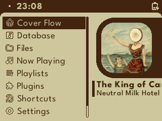

<p align="center">
  
  <h1 align="center">Rockpod</h1>
  <p align="center">
    Custom Rockbox firmware for iPod Classic and iPod Video.<br>
    MFi digital audio, Cover Flow, dynamic colors.
  </p>
  <p align="center">
    <a href="https://github.com/nuxcodes/rockpod/releases/latest"></a>
    <br/>
    <a href='https://ko-fi.com/B0B61UR8ZH' target='_blank'></a>
  </p>
</p>

---

Rockpod is a [Rockbox](https://www.rockbox.org) fork for iPod Classic (6th/7th gen, 2007–2014) and iPod Video (5th/5.5th gen, 2005–2006). It adds MFi digital audio output, a rewritten Cover Flow, dynamic album art colors, and SSD-aware power management.

Rockpod supports both HDD and iFlash-modded units. Both iPod models share the same 320x240 display and get the same UI features — Cover Flow, dynamic colors, themes, and rendering improvements. Hardware-specific features like SSD power management and MFi digital audio are iPod Classic only for now. It's a drop-in replacement for the official Rockbox firmware, with no reformatting or data loss.

---

## Features

### Digital Audio Output
> Supported on iPod Classic 6G/7G

Rockpod is the first open source firmware to support digital audio output over the iPod's dock connector. It handles the full Apple iAP authentication handshake, negotiates sample rate with the accessory, and sends bit-perfect PCM over USB, bypassing the iPod's internal DAC. The entire Rockbox DSP chain (EQ, crossfeed, replaygain) is preserved in the output path.

This works with any MFi iPod dock connector accessory — DACs, speakers, docks, car stereos, and other digital audio accessories built for the iPod.

- **Full iAP/IDPS authentication** — certificate exchange, challenge-response, FID token negotiation, Digital Audio Lingo activation
- **3 MB TX ring buffer** — absorbs codec decode bursts and compensates for I2S/USB clock drift (~44,117 Hz vs 44,100 Hz)
- **Double-buffered ISO IN** — DMA re-arm decoupled from audio pull for glitch-free streaming on docks with HID polling
- **Glitch-free transitions** — fade-in on play, fade-out on pause/underflow, buffer flush between tracks
- **Full DSP chain preserved** — EQ, crossfeed, replaygain, stereo width all apply before the USB stream
- **HP amps auto-mute** — CS42L55 headphone amplifiers power down during USB streaming
- **USB-C compatible** — digital audio output also works with USB-C connector mods

None of this existed in Rockbox before. It required building a new protocol stack from scratch: USB Audio Class 1.0 source mode, Apple's iAP/IDPS authentication (certificate exchange, challenge-response, FID token negotiation), a custom iAP-over-USB-HID transport layer, and Digital Audio Lingo to activate streaming.

<details>
<summary><strong>Compatible devices</strong></summary>

Any iPod dock connector accessory that uses Digital Audio Lingo (0x0A) should work. The OPPO HA-2SE is the primary tested device. DACs, speakers, docks, and car stereos that accept digital audio from an iPod are all expected to be compatible.

**DACs**

- OPPO HA-2 / HA-2SE
- Sony PHA-1 / PHA-1A
- Sony PHA-2 / PHA-2A
- Onkyo DAC-HA200
- Denon DA-10
- JDS Labs C5D
- Fostex HP-P1
- Cypher Labs AlgoRhythm Solo / Solo -dB

**Speakers / Docks** — MFi-certified speakers and docks that use digital audio (not analog line-out) over the dock connector should also work.

</details>

<details>
<summary><strong>Under the hood: signal flow</strong></summary>

```
iPod connects via dock USB
    │
    ├─ USB enumeration: Config 2 = UAC1 source + iAP HID (Apple VID/PID 0x05AC:0x1261)
    │
    ├─ iAP authentication over USB HID:
    │     StartIDPS → SetFIDTokenValues → EndIDPS
    │     → MFi certificate exchange → challenge-response
    │
    ├─ Digital Audio Lingo activation:
    │     GetAccSampleRateCaps → TrackNewAudioAttributes @ 44.1 kHz
    │
    ├─ Accessory selects alt-setting on source streaming interface
    │
    └─ Audio path:
          Codec → DSP (EQ, crossfeed, replaygain)
            → PCM mixer → buffer hook → TX ring buffer
              → double-buffered ISO IN → MFi accessory
```

The iAP HID transport handles multi-report fragmentation for large payloads (128-byte RSA signatures span multiple HID reports, reassembled via link control bytes). Transaction IDs are tracked and echoed for all post-IDPS commands.

Key files:

- `firmware/usbstack/usb_audio.c` — source mode streaming engine
- `firmware/usbstack/usb_iap_hid.c` — iAP-over-USB-HID transport (new)
- `firmware/usbstack/usb_core.c` — dual USB configuration
- `apps/iap/iap-lingo0.c` — IDPS protocol, Digital Audio Lingo
</details>

---

### Cover Flow

Stock PictureFlow shows 3 slides, uses hardcoded colors, and is buried in the plugins menu. Rockpod rewrites the renderer to match Apple's Cover Flow — 7 visible slides w/ uniform tilt angle, custom theme integration, status bar toggle, faster transitions — and promotes it to a top-level menu entry.

<!-- TODO: Add before/after screenshot — stock PictureFlow vs Rockpod Cover Flow -->

|                     Cover Flow                     |                        Full-screen mode                         |
| :------------------------------------------------: | :-------------------------------------------------------------: |
|  |  |
|                   Status bar on                    |                     Status bar toggled off                      |

|                          Track list                          |                      Display settings                       |
| :----------------------------------------------------------: | :---------------------------------------------------------: |
|  |  |
|             Title only — no track number prefix              |                Slide tuck, crossfade, speed                 |

- **Theme-aware colors** — slide edges and backgrounds fade toward your theme's background color, not hardcoded black
- **Status bar support** — integrates with the SBS status bar, showing "Cover Flow" in the title bar. Can be toggled off for full-screen mode
- **7 visible slides w/ parallel slide rendering** — matching Apple's Cover Flow projection
- **Configurable transition speed** — scroll and transition speeds are adjustable in display settings
- **Text crossfade** — album and artist text fades smoothly between slides instead of snapping
- **100-slot slide cache** (up from 64), Bayer-ordered dithering, 1-second background polling in SSD mode
- **Track list** shows title only — no "1.03 -" disc/track number prefixes
- **No startup delay** — the 2-second "Loading..." splash is eliminated under SSD mode

---

### Dynamic Colors

The UI automatically extracts dominant and accent colors from the currently playing album art and applies them across all skinnable screens — menus, status bar, and now playing. Colors fade smoothly over 500 ms when the track changes.

|                                                          |                                                          |
| :------------------------------------------------------: | :------------------------------------------------------: |
|        |        |
|        |        |

- **Album art color extraction** — dominant and accent colors pulled from the current track's artwork
- **Full theme color coverage** — foreground, background, selector bar, selector text, selector gradient, and list separators all adapt
- **Smooth transitions** — 500 ms fade between color palettes on track change
- **Contrast enforcement** — accent colors are pushed brighter or darker if insufficient contrast against the dominant color
- **On by default** — can be toggled off under Theme Settings

---

### Storage Mode
> Supported on iPod Classic 6G/7G

Rockpod works with both stock HDDs and iFlash SSD mods. HDD behavior is unchanged from stock Rockbox. When an SSD is detected, Rockpod switches to a lighter sleep strategy — faster wake times, lower idle power draw, and no unnecessary spin-up delays.

| Storage Mode                                         |
| :--------------------------------------------------- |
|  |
| Auto-detect, or manually select HDD / SSD            |

- **Auto-detection** via ATA IDENTIFY heuristics (rotation rate, form factor, TRIM support, CFA compliance)
- **Two-phase idle sleep** — clock-gate after 7 seconds (near-instant wake), then cut AUTOLDO after 30 seconds with backlight off
- **Instant wake from clock-gate** — no bus reset, no re-identify (<5 ms)
- **Pre-wake on backlight** — storage wakes when the screen turns on, ready before you navigate
- **HDD features bypassed** — APM and AAM skipped for SSDs
- **Plugin splash skipped** — no "Loading..." screen when load times are negligible

<details>
<summary><strong>Under the hood: sleep states</strong></summary>

| State           | What happens                                  | Wake time |
| --------------- | --------------------------------------------- | --------- |
| **Active**      | Normal operation                              | —         |
| **Clock-gated** | ATA clock off, flash powered, GPIOs held      | <5 ms     |
| **Deep sleep**  | AUTOLDO cut, GPIOs tri-stated, controller off | ~330 ms   |

Stock HDD behavior: full power-down + re-init at ~530 ms.

Key file: `firmware/target/arm/s5l8702/ipod6g/storage_ata-6g.c`

</details>

---

### Power Management
> Supported on iPod Classic 6G/7G

- **I2S clock gating** — bus clock gated when no audio is playing
- **Codec idle power-down** — CS42L55 enters PDN_CODEC on idle, pop-free resume (master mute → power-down → 200 us settle → unmute)
- **Smart charger detection** — LTC4066 `!CHRG` pin sampled with backlight-gated timing and 500 ms settle to distinguish real chargers from weak USB sources like MFi accessories
- **Charge gate** — GPIO C1 blocks battery charging when USB can't deliver 500 mA, preventing accessory battery drain
- **Auto-poweroff with USB** — device shuts down after idle timeout even with non-charging USB connected (stock blocks poweroff indefinitely on any USB)
- **iAP idle tick** — polling drops from 10 Hz to 1 Hz after auth, saving ~9 CPU wakeups/sec

<details>
<summary><strong>Under the hood: LTC4066 charge control</strong></summary>

| GPIO      | Function          | Rockpod behavior                       |
| --------- | ----------------- | -------------------------------------- |
| B6 (HPWR) | USB current limit | LOW = 100 mA, HIGH = 500 mA            |
| B7 (SUSP) | USB suspend       | Prevents any USB power draw            |
| C1        | Charge disable    | HIGH blocks charging from weak sources |

When connected to an MFi accessory without a power bank, C1 goes HIGH during backlight-off to block trickle drain. On backlight-on, C1 goes LOW to sample `!CHRG` — if charging is detected, it stays LOW.

Key files: `firmware/target/arm/s5l8702/ipod6g/power-6g.c`, `powermgmt-6g.c`

</details>

---

### Menu

All standard Rockbox menu items are available.

|                     Main menu                     |                    Database track list                     |
| :-----------------------------------------------: | :--------------------------------------------------------: |
|  |  |
|       Full menu available, shown customized        |         Title only — no disc/track number clutter          |

---

### Improved UI Rendering

- **Scroll-to-start flash eliminated** — custom themes with scrolling text in the main menu would flash or flicker when the scroll position reset to the start. Rockpod fixes the viewport rendering order to prevent this, making themed menus render cleanly without visual artifacts.
- **Track name cleanup** — strips the "01 " numeric prefix that iTunes sync adds to filenames, so tracks display by their actual title across Cover Flow, Database, and WPS

---

### Bundled Themes

The repo includes third-party themes under `themes/`:

- **adwaitapod_dark_simplified** — modified with swapped play/pause button icons. Original by [Dook](https://github.com/D0-0K/adwaitapod) (CC-BY-SA). Theme zip available in the [v2.0 release](https://github.com/nuxcodes/rockpod/releases/tag/v2.0).
- **Themify 2** — modified with corrected menu text centering. Original by [Dook](https://github.com/D0-0K/themify).

---

## Supported Models

| Feature                   | iPod Classic (6G/7G)  | iPod Video (5G/5.5G) |
| ------------------------- | --------------------- | -------------------- |
| **MFi digital audio**     | Yes                   | Planned              |
| **Cover Flow**            | Yes                   | Yes                  |
| **Dynamic Colors**        | Yes                   | Yes                  |
| **UI improvements**       | Yes                   | Yes                  |
| **Themes**                | Yes (320x240)         | Yes (320x240)        |
| **SSD power management**  | Yes                   | No                   |
| **Advanced power mgmt**   | Yes                   | No                   |

## At a Glance

|                         | Stock Rockbox                           | Rockpod                                        |
| ----------------------- | --------------------------------------- | ---------------------------------------------- |
| **MFi digital audio**   | Not supported                           | DACs, speakers, docks — Classic only           |
| **Dynamic colors**      | Not supported                           | Album art color extraction with smooth fades   |
| **Cover Flow**          | 3 slides, no status bar, 70-degree tilt | 7 slides, status bar, parallel projection      |
| **SSD idle**            | Full power-down, ~530 ms wake           | Clock-gate, <5 ms wake — Classic only          |
| **Codec power**         | Always on                               | Auto power-down on idle — Classic only         |
| **USB power**           | Charges from any USB source             | Smart charge gating — Classic only             |
| **Auto-poweroff + USB** | Blocked indefinitely                    | Works for non-charging accessories — Classic only |

---

## Installation

> **Prerequisite:** Your iPod must already have the Rockbox bootloader installed. See the [Rockbox installation guide](https://www.rockbox.org/wiki/RockboxUtility) if needed.

1. Download the correct zip from [Releases](https://github.com/nuxcodes/rockpod/releases/latest):
   - `rockbox-ipod6g.zip` for iPod Classic (6G/7G)
   - `rockbox-ipodvideo-5g.zip` for iPod Video (5G/5.5G)
2. Connect your iPod in disk mode
3. Extract the zip to the root of the iPod (creates/updates `.rockbox`)
4. Eject and reboot

PictureFlow rebuilds its album art cache on first launch after upgrade. This is automatic.

---

## Building from Source

```bash
# iPod Classic 6G (default, clean build)
./build-hw.sh

# iPod Video 5G (clean build)
./build-hw.sh 5g

# Incremental rebuild
cd build-hw-ipod6g && make -j$(sysctl -n hw.ncpu) && make zip
cd build-hw-ipodvideo && make -j$(sysctl -n hw.ncpu) && make zip

# Simulator (6G)
./build-sim.sh
cd build-sim && ./rockboxui
```

`build-hw.sh` accepts `ipod6g` / `6g` (default) or `ipodvideo` / `5g`. Output goes to `build-hw-<target>/`. Cross-compiler toolchains: `tools/rockboxdev.sh`.

---

## Roadmap

**iPod Video 5G/5.5G MFi digital audio.** iPod Video builds are available with all UI features (Cover Flow, dynamic colors, themes). MFi digital audio has been ported to the PP5022/ARC USB controller but is untested on hardware. Alpha builds are available for testing.

**Generic USB audio support via host mode.** The current support uses USB device mode — the accessory is the host and the iPod authenticates as an Apple audio source. This only works with iPod MFi accessories. The next step is USB host mode, where the iPod becomes the host and sends audio to any class-compliant UAC device — standard USB-C DAC dongles via a dock-to-OTG adapter. The S5L8702's DWC OTG controller supports host mode in hardware; the work is in the host stack and UAC class driver.

---

## Known Limitations

- **iPod MFi accessories only** — generic UAC sinks not yet supported (see Roadmap)
- **16-bit PCM, 44.1 / 48 kHz** — USB Audio Class 1.0 ceiling
- **iPod Classic and iPod Video only** — untested on other Rockbox targets
- **No USB DAC (sink) mode** — USB audio config is repurposed for digital audio output
- **Rockbox bootloader required** — needs an existing Rockbox installation

---

## Credits

Built on the work of the [Rockbox](https://www.rockbox.org/) project and its contributors.

- **Themes:** adwaitapod_dark_simplified and Themify 2 by [Dook](https://github.com/D0-0K) (CC-BY-SA)
- **MFi reference:** [ipod-gadget](https://github.com/oandrew/ipod-gadget) descriptor layout, [rockbox-mojyack](https://github.com/mojyack/rockbox) iPod 5G iAP implementation, Apple MFi Accessory Firmware Specification

## License

[GNU General Public License v2.0](https://www.gnu.org/licenses/old-licenses/gpl-2.0.html)
